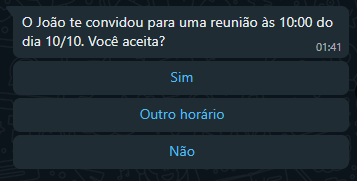
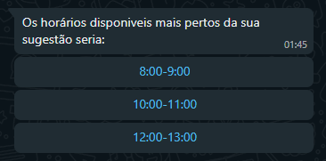

### Notes for Creating a Meeting Scheduling Bot

#### Supervisor Structure

##### Steps for Scheduling

1. The host agent assists in choosing a time for a meeting with the guest.
2. The host agent calls the tool/function and sends a message to the guest suggesting a time. Example message:

   

3. If the guest chooses another time, they can suggest a time, and the bot will respond with a message suggesting 3 times. Example message:

   

4. Confirms with the host and creates the event in the calendar. Example message:

   

5. Sends the confirmation message to the guest.

#### Things to Consider

1. **Date Format Issues**: The calendar tool has issues with the DD/MM/YYYY format.
2. **Data Protection**: StructuredOutput will not allow the leakage of schedule information.
3. **Integration with Google Meet**: Develop a tool for creating meetings in Google Meet (lastly).
4. **User Errors**: Respond with an error message every time the user sends a strange prompt.

#### Chat Abuse/Spam Problem

- **Spam Prevention**: Create a mechanism to prevent others from sending messages that are not responses to the bot.

#### Details about the Agents

1. **Host Agent**:

   - Uses the calendar tool (complete) to help the host find a free time.
   - Sends a message to the guest suggesting a time.

2. **Guest Agent**:

   - Structured output to create the message with buttons suggesting available times using the calendar tool in "view" mode.
   - Another agent or the same one that accepts normal text and has a structured output to confirm.
