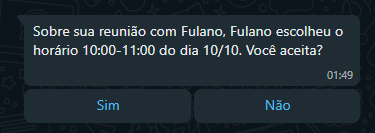

# Anotações para Criação de um Bot de Agendamento de Reuniões

## Estrutura do Supervisor

### Passos para Agendamento

1. O agente do anfitrião ajuda-o a escolher um horário para uma reunião com o convidado.
2. O agente do anfitrião chama a ferramenta/função e envia uma mensagem ao convidado sugerindo um horário. Exemplo de mensagem:

3. Caso o convidado escolha outro horário, ele pode sugerir um horário e o bot responderá com uma mensagem sugerindo 3 horários. Exemplo de mensagem:

4. Confirma com o anfitrião e cria o evento no calendário. Exemplo de mensagem:
   
5. Envia a mensagem de confirmação para o convidado.

## Coisas a Considerar

1. **Problemas com Formato de Data**: A ferramenta de calendário tem problemas com o formato DD/MM/AAAA.
2. **Proteção de Dados**: StructuredOutput não permitirá o vazamento de informações da agenda.
3. **Integração com Google Meet**: Desenvolver uma ferramenta para a criação de reuniões no Google Meet (por último).
4. **User Errors**: Responder uma mensagem de erro toda vez que o usuário mandar um prompt estranho.

## Problema de Abuso/Spam no Chat

- **Prevenção de Spam**: Criar um mecanismo para impedir que outras pessoas enviem mensagens que não sejam respostas ao bot.

## Detalhes sobre os Agentes

1. **Agente do Anfitrião**:

   - Utiliza a ferramenta do calendário (completa) para ajudar o anfitrião a encontrar um horário livre.
   - Envia uma mensagem ao convidado sugerindo um horário.

2. **Agente do Convidado**:

   - Output estruturado para criar a mensagem com botões sugerindo horários disponíveis usando a ferramenta do calendário em modo "visualização".
   - Outro agent ou o mesmo que aceite texto normal e tenha um output estruturado para confirmar.
